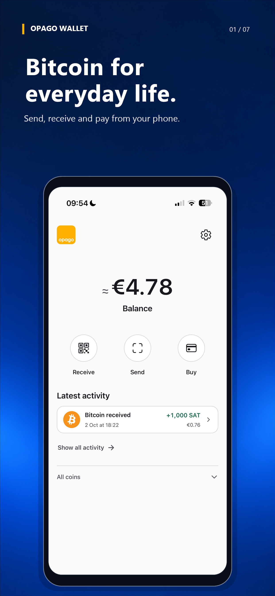
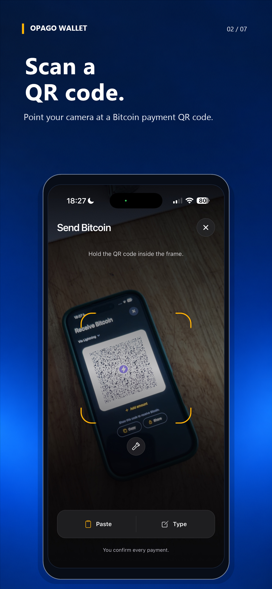
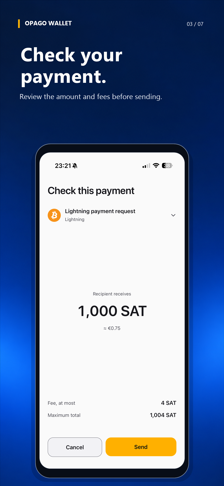
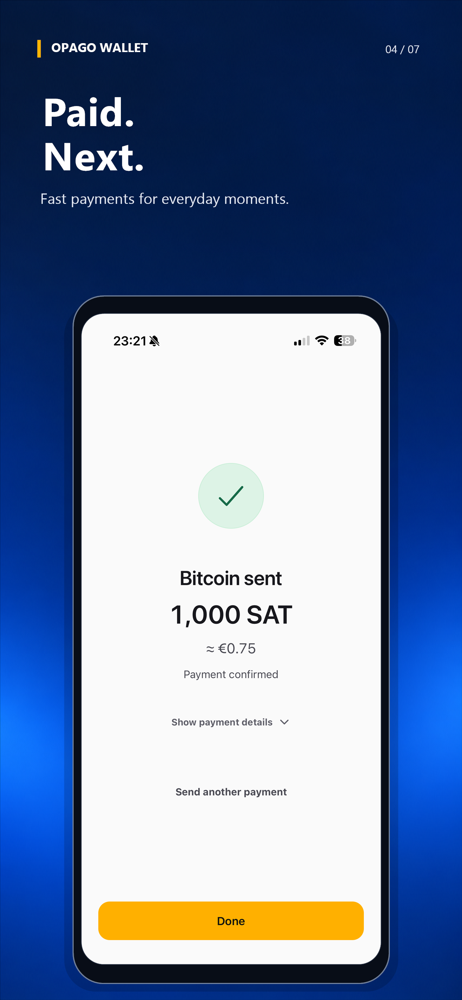
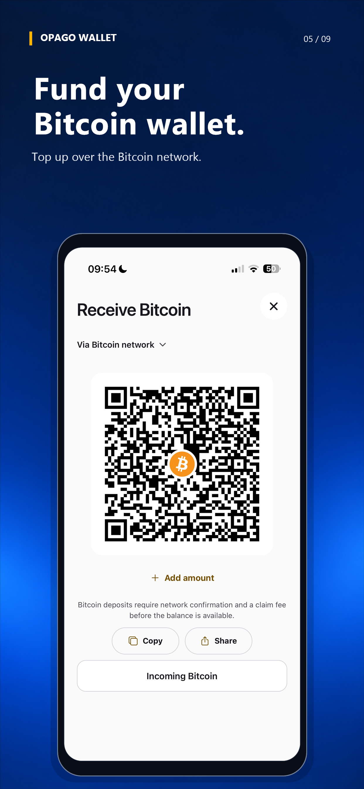
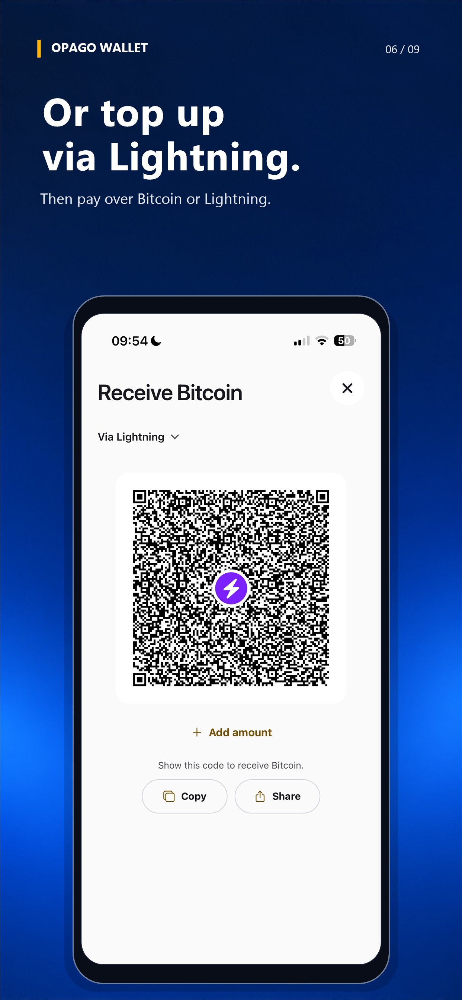
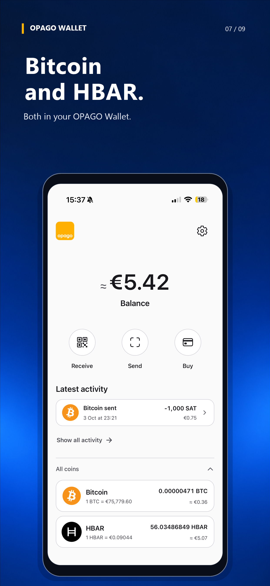
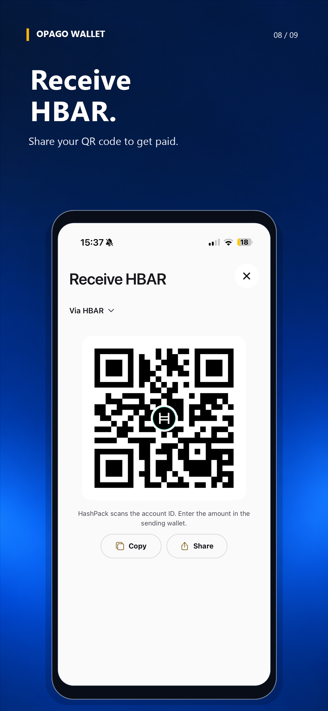
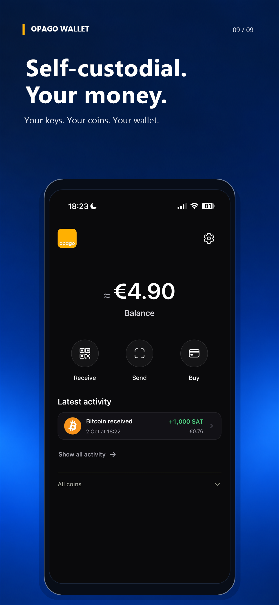

# OPAGO Wallet

**Send, receive and pay with Bitcoin. Your everyday wallet.**

Make Bitcoin part of your everyday life. With OPAGO Wallet, you can send, receive and pay with Bitcoin right from your phone. Simple and easy to use, even if you're new to Bitcoin.

## Scan. Check. Pay.

From a coffee on the go to shopping at a store that accepts Bitcoin: scan the QR code, check the payment details and confirm.

## Send and receive Bitcoin

Send Bitcoin to friends and family or receive it from others. To get paid, simply share your QR code or payment request.

## Fast payments with Lightning

OPAGO supports Lightning for fast Bitcoin payments, making it easy to send and receive even small amounts. You can also transfer Bitcoin over the Bitcoin network.

## Everything at a glance

See your Bitcoin balance and its value in euros. Keep track of past payments and their status, and review the amount and fees before you send.

## Your Bitcoin. Your control.

With OPAGO, you control your Bitcoin. Your recovery words let you restore your wallet on a new device. Keep them somewhere safe.

Alongside Bitcoin, OPAGO also supports HBAR, available under additional coins.

Whether it's your first Bitcoin payment or already part of your daily routine, OPAGO Wallet keeps it simple.

Download OPAGO Wallet and start using Bitcoin in everyday life.

## See it in action

  

  

  

  

  

  

  

  

  

---

[Website](https://www.opago.com) · [Privacy policy](https://www.opago.com/wallet/privacy) · [Support](mailto:support@opago.com)
